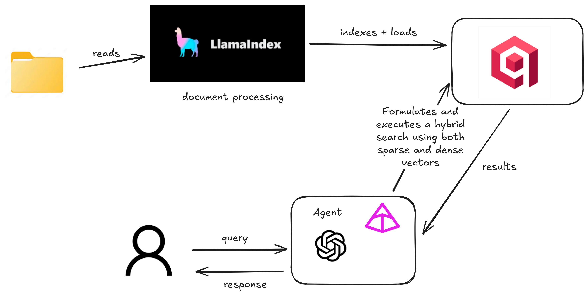

# Hybrid Agentic RAG



**Hybrid Agentic RAG** is a robust **Retrieval-Augmented Generation (RAG)** system built with modern Python tools. It leverages **LlamaIndex** for Document Processing, **Qdrant** for hybrid vector storage, and **Pydantic AI** for defining intelligent agents.

This system is designed to ingest documents (PDFs) from a local directory, index them using a hybrid approach (Dense Vectors + BM25), and provide an AI agent that can strictly answer questions based on the retrieved context.

## 🚀 Features

- **Agentic RAG**: Powered by `pydantic-ai`, the agent intelligently uses tools to retrieve context before answering.
- **Hybrid Search**: Utilizes **Qdrant**'s hybrid search capabilities (Dense Embeddings + Sparse BM25) for superior retrieval accuracy.
- **Robust Ingestion**: Automated ingestion pipeline using `llama-index`'s `SimpleDirectoryReader` to process PDF documents.
- **Strict Context Adherence**: System prompts are engineered to ensure the AI answers *only* using retrieved data, minimizing hallucinations.
- **Async & Sync Support**: Built with both synchronous and asynchronous capabilities for high performance.
- **Rich Logging**: Beautiful console output using `rich` for easy debugging and monitoring.

## 🛠️ Tech Stack

- **Language**: Python 3.13+
- **Document Processing**: [LlamaIndex](https://www.llamaindex.ai/)
- **Vector Database**: [Qdrant](https://qdrant.tech/)
- **Agent Framework**: [Pydantic AI](https://github.com/pydantic/pydantic-ai)
- **LLM Provider**: OpenAI (via `pydantic-ai` and `llama-index`)
- **Dependency Management**: `uv`

## 📂 Project Structure

```text
Hybrid Agentic RAG  /
├── data/                  # Directory for storing PDF documents to be ingested
├── src/
│   ├── agent.py           # Main agent definition and tool logic
│   ├── ingestion.py       # Data loading and processing logic
│   ├── prompt.py          # System prompts and instructions
│   ├── vector_store.py    # Qdrant client and index management
│   └── notebook.ipynb     # Jupyter notebook for experimentation
├── .env                   # Environment variables (API keys)
├── pyproject.toml         # Project dependencies and configuration
└── README.md              # Project documentation
```

## ⚡ Getting Started

### Prerequisites

- **Python 3.13+** installed.
- **Qdrant** instance (Cloud or Local Docker).
- **OpenAI API Key**.
- **uv** (recommended for dependency management).

### Installation

1. **Clone the repository**:

   ```bash
   git clone https://github.com/devgomesai/Hybirid-Agentic-RAG.git
   cd Hybrid Agentic RAG  
   ```
2. **Install dependencies**:
   Using `uv`:

   ```bash
   uv sync
   ```

   Or using standard pip:

   ```bash
   pip install -r requirements.txt
   ```

### Configuration

Create a `.env` file in the root directory with the following variables:

```ini
# Qdrant Configuration
QDRANT_API=your_qdrant_url_here
QDRANT_API_KEY=your_qdrant_api_key_here

# OpenAI Configuration
OPENAI_API_KEY=your_openai_api_key_here
LLM_MODEL=gpt-4o-mini  # Optional, defaults to gpt-4o-mini
```

### 📚 Data Ingestion

Place your PDF documents (e.g., research papers, manuals) into the `data/` directory. The system acts on the files present in this folder.

## 🏃 Usage

The core logic resides in `src/agent.py`. The system initializes the ingestion process automatically if the vector collection does not exist.

To run the agent (depending on how you wish to serve it):

**Direct Execution**:

1. (Note: The current `src/agent.py` exposes an `app` object. You may need to integrate this with a runner or server depending on your specific Pydantic AI deployment setup).

   To test the components individually, you can run:

   ```bash
   # Ingestion, Indexing and Web-UI for Testing
   uvicorn src.agent:app --host 127.0.0.1 --port 7932
   ```

## 🧠 How It Works

1. **Ingestion**: `Ingestion` class reads files from `data/`.
2. **Indexing**: `VectorDB` class creates a collection in Qdrant. It uses a **Hybrid Search** approach.
   * **Dense Vectors**: These are the embeddings you are likely familiar with (OpenAI, BGE, SentenceTransformers). They create a numerical representation (a long list of numbers) of a piece of text. Dense vectors capture rich semantics across the entire text.
   * **Sparse Vectors**: These are slightly different and use specialized models (TF-IDF, BM25, SPLADE) to generate vectors that are mostly zeros. They excel at capturing specific keywords and fine-grained details.
   * *Reference*: [LlamaIndex Qdrant Hybrid Search](https://developers.llamaindex.ai/python/examples/vector_stores/qdrant_hybrid/)
3. **Retrieval**: When a query is received, the `agent` uses the `search_documents` tool. This tool queries Qdrant to find the most relevant chunks of text.
4. **Generation**: The LLM (OpenAI) receives the retrieved chunks and the user's query, synthesizing an answer strictly based on the provided context.
